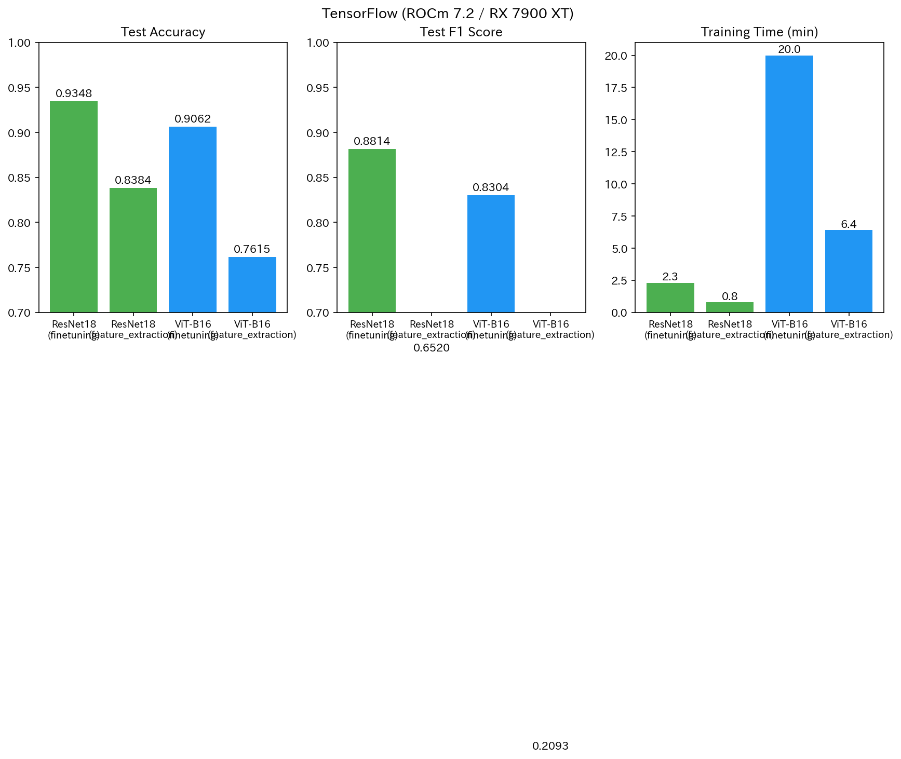
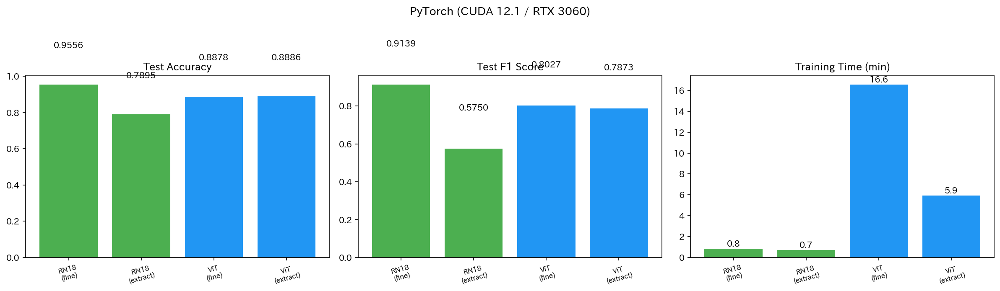
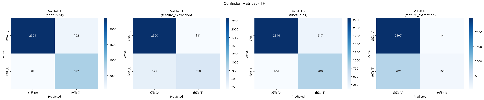
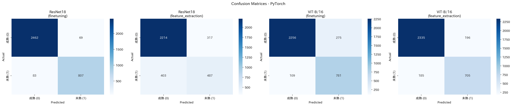
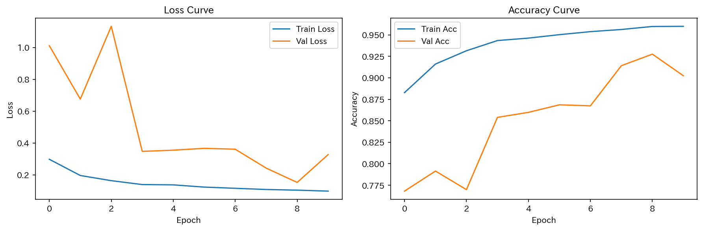
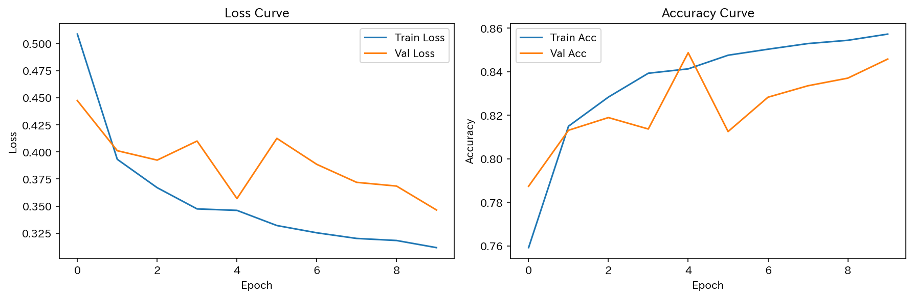
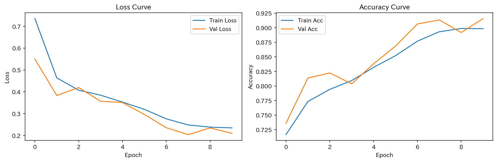
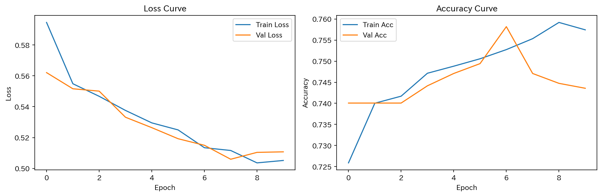

# Blood Cell AI - TensorFlow版（AMD ROCm移植）

血液細胞の2クラス分類（成熟細胞 vs 未熟細胞）を行う深層学習プロジェクト。

## 目的

[PyTorch + CUDA (RTX 3060)](https://github.com/tanadeyu/blood-cell-ai) で構築されたコードを、
**TensorFlow + ROCm (RX 7900 XT)** に移植し、AMD GPU環境でも同一タスクが実行できるかを検証する。
合わせて、同一モデル・同一データでの **PyTorch(CUDA) vs TensorFlow(ROCm)** の性能比較を行う。

- **データセット**: BloodMNIST (MedMNIST v2) — 28×28 血液細胞画像
- **タスク**: 2クラス分類（8クラスを臨床的観点からグループ化）
- **モデル**: ResNet18 / ViT-B/16（PyTorch版 torchvision と同一構成）
- **フレームワーク**: TensorFlow 2.19 + Keras 3（ROCm / Docker / WSL2）
- **GPU**: AMD Radeon RX 7900 XT (20GB, gfx1100)

> **備考**:
> - 環境をWSL2 + Docker（ROCm 7.2）に統一。DirectML版（TF 2.10）からの移行。
> - XLA JITはROCm + gfx1100でバグが発生し使用不可。XLA無効での動作となる。
> - TFのmixed_float16はGradScaler非対応のためNaN回避で学習率を調整。結果的にPyTorch版と完全同一条件ではないが、概要の性能比較は可能。
> - PCクラッシュ防止のため`memory_limit`やDockerメモリ制限を設定。詳細は注意事項参照。

---

## 環境構築

### 必要環境

| 項目 | 要件 |
|------|------|
| OS | Windows 11 + WSL2（Ubuntu 22.04） |
| GPU | AMD Radeon RX 7900 XT（gfx1100） |
| ROCm | 7.2.4 |
| Docker | 29.5.3+ |
| メモリ | 32GB+ 推奨 |

### セットアップ手順

#### 1. WSL2 + ROCm の準備

詳細は `docs/2026-06-18_WSL2-ROCm-setup.md` 参照。

```bash
# WSL2 で Ubuntu 22.04 をインストール
wsl --install -d Ubuntu-22.04

# ROCm 7.2 のインストール（WSL2用）
# ※ amdgpu-install_7.2.70200-1_all.deb を使用
```

#### 2. Docker イメージのビルド

```bash
cd /path/to/bld-cell-ai-TF
docker build -t tf-rocm-bloodcell .
```

初回ビルドは約10〜15分かかります。

#### 3. Jupyter の起動

```bash
./run_jupyter.sh
```

`http://localhost:8888` にアクセス。

---

## 実行方法

### ノートブック実行順

| # | ノートブック | 内容 | 所要時間 |
|:-:|:-----------|:-----|:--------:|
| 1 | `01_環境構築とデータ準備.ipynb` | データダウンロード・確認 | 1分 |
| 2 | `02_ResNet18学習.ipynb` | ResNet18 学習 (finetuning / feature_extraction) | 各3分 |
| 3 | `03_ViT学習.ipynb` | ViT-B/16 学習 (finetuning / feature_extraction) | 各6〜20分 |
| 4 | `04_最終評価.ipynb` | 両モデル比較（TF版 vs PyTorch版） | 1分 |

### 設定の切り替え

各ノートブックの上部で以下のフラグを変更できます：

| フラグ | 値 | 説明 |
|:-------|:---|:-----|
| `USE_FINETUNING` | `True` / `False` | 全層学習 / 最終層のみ学習 |
| `USE_PRETRAINED` | `True` | PyTorch ImageNet 変換済み重みを使用 |
| `BATCH_SIZE` | 64 / 32 / 16 | VRAM使用量と速度のトレードオフ |
| `LR` | 0.0005 / 0.0001 | 学習率（mixed_float16では低め推奨） |

※ `USE_PRETRAINED=False` は未検証（重み変換スクリプトが必要）。

---

## データセット

[BloodMNIST](https://medmnist.com/)（MedMNIST v2）を使用。

- **元のクラス**: 8クラス（成熟: 0,1,4,5,6,7 / 未熟: 2,3）
- **入力サイズ**: 28×28（ResNet18）/ 224×224（ViT、リサイズ後）
- **分割**: Train 11,959 / Val 1,712 / Test 3,421
- **正規化**: [-1, 1]（PyTorch版と同じ）

---

## モデル構成

### ResNet18

- BasicBlock x4 layers [2, 2, 2, 2]
- パラメータ数: 11.2M
- 入力: 28×28（stride=1, maxpoolなし）

### ViT-B/16

- Patch size: 16×16（Conv2D）
- 埋め込み次元: 768 / ヘッド数: 12 / トランス層: 12
- MLP次元: 3072
- パラメータ数: 85.6M
- 入力: 224×224（リサイズ後）

---

## 結果（TF版 vs PyTorch版）

### TensorFlow (ROCm 7.2 / RX 7900 XT)

| モデル | アプローチ | Accuracy | F1 | 学習時間 | VRAM |
|-------|-----------|:--------:|:--:|:--------:|:----:|
| ResNet18 | finetuning | **93.5%** | 88.1% | 2.3分 | 未計測 |
| ResNet18 | feature_extraction | **83.8%** | 65.2% | 0.8分 | 未計測 |
| ViT-B/16 | finetuning | **90.6%** | 83.0% | 20.0分 | 17GB |
| ViT-B/16 | feature_extraction | **76.1%** | 20.9% | 6.4分 | 3GB |

### PyTorch (CUDA 12.1 / RTX 3060)

| モデル | アプローチ | Accuracy | F1 | 学習時間 | VRAM |
|-------|-----------|:--------:|:--:|:--------:|:----:|
| ResNet18 | finetuning | **95.6%** | 91.4% | 0.8分 | 未計測 |
| ResNet18 | feature_extraction | **79.0%** | 57.5% | 0.7分 | 未計測 |
| ViT-B/16 | finetuning | **88.8%** | 80.3% | 16.6分 | 5.74GB |
| ViT-B/16 | feature_extraction | **88.9%** | 78.7% | 5.9分 | 未計測 |

> ⚠️ TF版ViT finetuningはNaN回避のためLR=0.0005（PyTorchは0.001）。PyTorch版ViT finetuningは事前学習重みが未適用の可能性あり。

**TF版 比較グラフ**



**PyTorch版 比較グラフ**



**TF版 混同行列**



**PyTorch版 混同行列**



### TF版 学習曲線

**ResNet18 (finetuning)**



**ResNet18 (feature_extraction)**



**ViT-B/16 (finetuning)**



**ViT-B/16 (feature_extraction)**



---

## 注意事項

### PCクラッシュ防止

- `TF_FORCE_GPU_ALLOW_GROWTH=true` で起動（VRAM一括確保を防ぐ）
- `memory_limit` をVRAMより低めに設定（例: 18155）
- Dockerに `--memory="18g"` 制限を設定
- 詳細は `notes/crash-prevention.md` 参照

### XLA JIT 使用不可

ROCm 7.2 + gfx1100 ではXLA JITが以下のバグで動作しません：

1. **GEMM autotune mismatch**: 行列積アルゴリズムの結果不一致でクラッシュ
2. **Conv2D workspace不足**: MIOpenのワークスペース確保に失敗

→ `tf.config.optimizer.set_jit(False)` + `jit_compile=False` で完全無効化が安定。

### NaN 対策

TFの `mixed_float16` はPyTorchのAMPと異なり **GradScalerによる自動勾配スケーリングがない** ため、学習初期の大きなlossでNaNが発生しやすい。学習率を0.0001〜0.0005に下げて対応。

## 結論

### 検証結果

PyTorch + CUDA（RTX 3060）のコードを TensorFlow + ROCm（RX 7900 XT）に移植し、同一データセット・同一モデル構成で性能比較を行った。

| 項目 | 結果 |
|:----|:-----|
| 移植の可否 | ✅ 動作確認完了（制約あり） |
| ResNet18 finetuning | 93.5%（PyTorch比 -2.1%） |
| ViT-B/16 finetuning | 90.6%（PyTorch比 +1.8%） |

### 判明した制約

1. **XLA JIT 使用不可**: ROCm 7.2 + gfx1100 ではGEMM autotune / Conv2D workspaceのバグで使用できず。XLA無効が安定。
2. **NaN問題**: TFのmixed_float16はGradScaler非対応のため、学習率調整（0.0005）で回避が必要。
3. **VRAM効率**: PyTorch + CUDA比で約3倍のVRAMを使用。
4. **PCクラッシュ防止**: VRAM一括確保を防ぐ設定（`growth=true`, `memory_limit`, Docker制限）が必須。

### 所感

AMD ROCm環境でのTensorFlow動作は実用可能だが、XLA JITやメモリ管理の面でCUDA環境より安定性・効率が劣る。特にGPUの演算特性に起因する問題が複数あり、同一コードの完全な互換動作には至らなかった。PyTorch + CUDAの開発体験の完成度を実感する結果となった。

### 注意・免責事項

- 本プロジェクトは**教育的・ポートフォリオ目的**です
- **医療診断用途での使用は strictly prohibited（厳禁）** です
- BloodMNISTデータセットは研究・教育用であり、実際の医療データとは異なります

---

## ファイル構成

```
bld-cell-ai-TF/
├── .conda/env/            # Python環境（DirectML用、現在不使用）
├── data/                  # BloodMNISTデータ
├── docs/                  # ドキュメント
├── images/                # 学習曲線・比較グラフ
├── models/                # 学習済み重み・結果YAML
├── pytorch_results/        # PyTorch版の結果YAML（比較用）
├── notebooks/             # Jupyterノートブック
│   ├── 01_環境構築とデータ準備.ipynb
│   ├── 02_ResNet18学習.ipynb
│   ├── 03_ViT学習.ipynb
│   └── 04_最終評価.ipynb
├── utils/
│   ├── results.py         # 結果の保存・読み込み
│   └── convert_weights.py # PyTorch→TF重み変換
├── Dockerfile             # ROCm TF 2.19 イメージ（rocm/tensorflow:rocm7.2.4 ベースに Jupyter等を追加）
├── run_jupyter.sh         # Jupyter起動スクリプト
├── run_shell.sh           # インタラクティブシェル
└── CLAUDE.md              # プロジェクトルール
```

---

## ライセンス

MIT License
